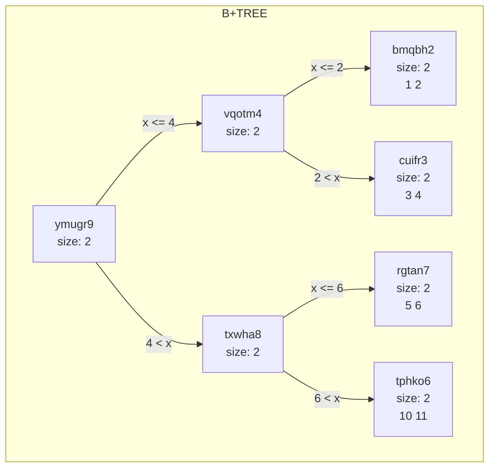
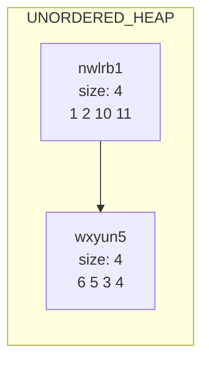

```mermaid
graph TD
subgraph B+TREE
ymugr9[ymugr9<br/>size: 2<br/>]
vqotm4[vqotm4<br/>size: 2<br/>]
bmqbh2[bmqbh2<br/>size: 2<br/>1 2 ]
vqotm4-->|x <= 2|bmqbh2
cuifr3[cuifr3<br/>size: 2<br/>3 4 ]
vqotm4-->|2 < x|cuifr3
ymugr9-->|x <= 4|vqotm4
txwha8[txwha8<br/>size: 2<br/>]
rgtan7[rgtan7<br/>size: 2<br/>5 6 ]
txwha8-->|x <= 6|rgtan7
tphko6[tphko6<br/>size: 2<br/>10 11 ]
txwha8-->|6 < x|tphko6
ymugr9-->|4 < x|txwha8
end
```

```mermaid
graph LR
subgraph UNORDERED_HEAP
nwlrb1[nwlrb1<br/>size: 4<br/>1 2 10 11 ]
wxyun5[wxyun5<br/>size: 4<br/>6 5 3 4 ]
nwlrb1-->wxyun5
end
```
