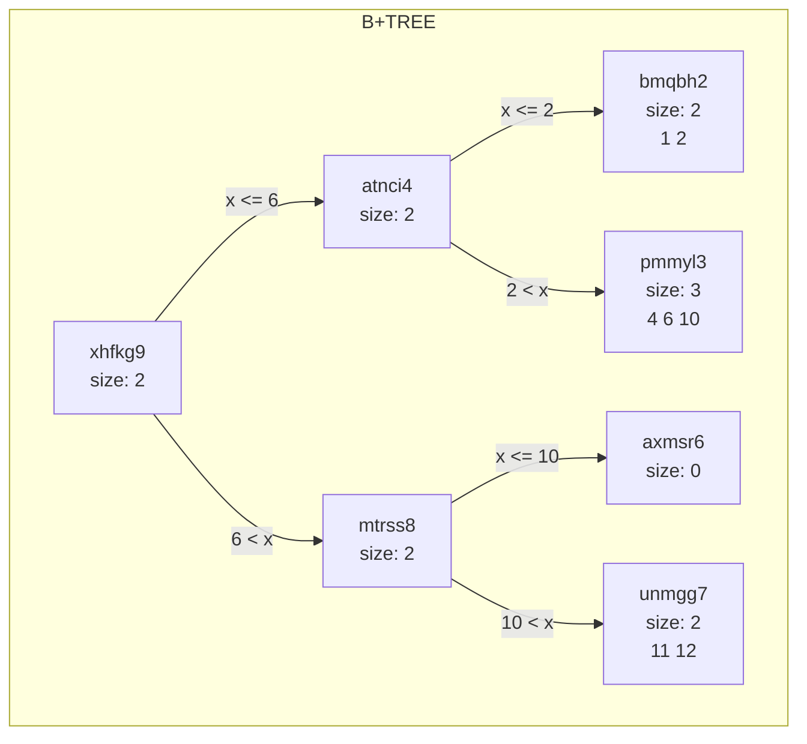
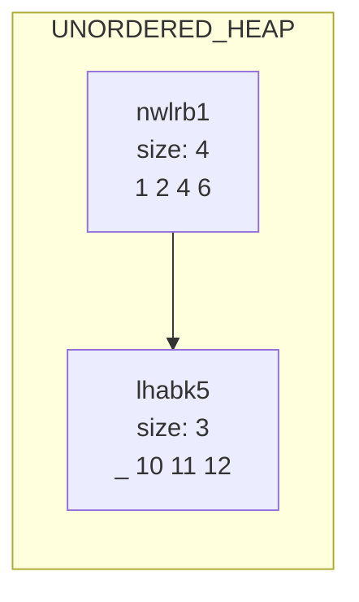

```mermaid
graph TD
subgraph B+TREE
xhfkg9[xhfkg9<br/>size: 2<br/>]
atnci4[atnci4<br/>size: 2<br/>]
bmqbh2[bmqbh2<br/>size: 2<br/>1 2 ]
atnci4-->|x <= 2|bmqbh2
pmmyl3[pmmyl3<br/>size: 3<br/>4 6 10 ]
atnci4-->|2 < x|pmmyl3
xhfkg9-->|x <= 6|atnci4
mtrss8[mtrss8<br/>size: 2<br/>]
axmsr6[axmsr6<br/>size: 0<br/>]
mtrss8-->|x <= 10|axmsr6
unmgg7[unmgg7<br/>size: 2<br/>11 12 ]
mtrss8-->|10 < x|unmgg7
xhfkg9-->|6 < x|mtrss8
end
```

```mermaid
graph LR
subgraph UNORDERED_HEAP
nwlrb1[nwlrb1<br/>size: 4<br/>1 2 4 6 ]
lhabk5[lhabk5<br/>size: 3<br/>_ 10 11 12 ]
nwlrb1-->lhabk5
end
```
