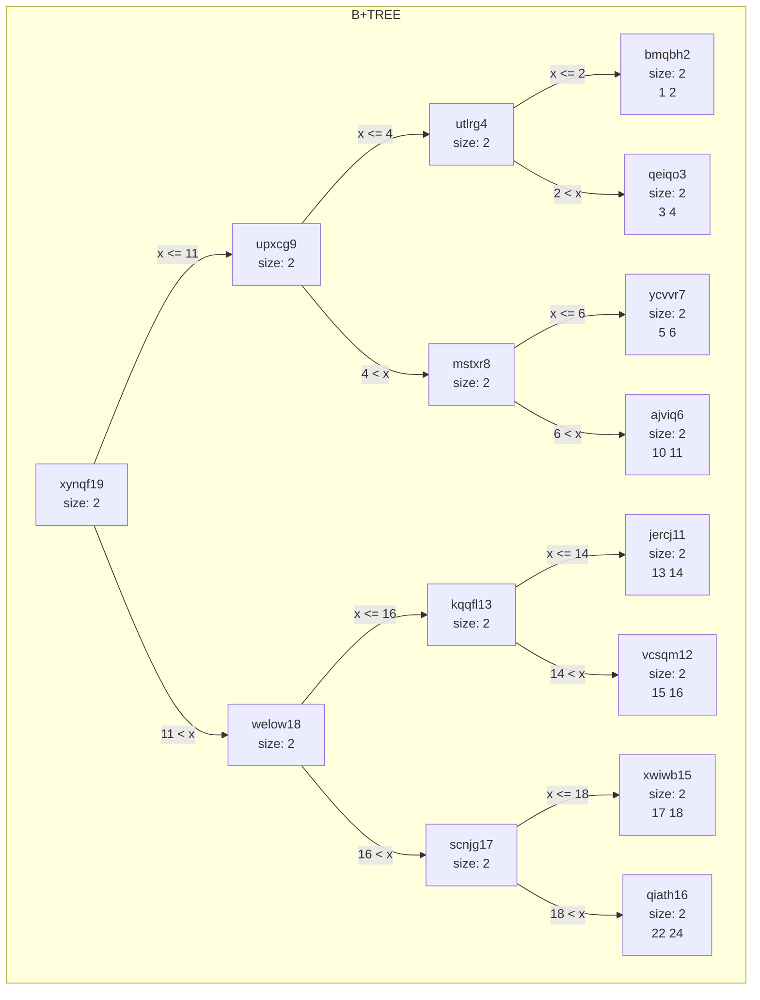
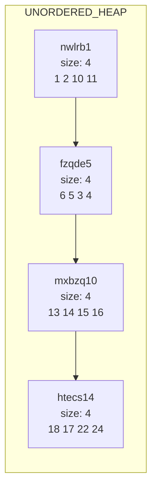

```mermaid
graph TD
subgraph B+TREE
xynqf19[xynqf19<br/>size: 2<br/>]
upxcg9[upxcg9<br/>size: 2<br/>]
utlrg4[utlrg4<br/>size: 2<br/>]
bmqbh2[bmqbh2<br/>size: 2<br/>1 2 ]
utlrg4-->|x <= 2|bmqbh2
qeiqo3[qeiqo3<br/>size: 2<br/>3 4 ]
utlrg4-->|2 < x|qeiqo3
upxcg9-->|x <= 4|utlrg4
mstxr8[mstxr8<br/>size: 2<br/>]
ycvvr7[ycvvr7<br/>size: 2<br/>5 6 ]
mstxr8-->|x <= 6|ycvvr7
ajviq6[ajviq6<br/>size: 2<br/>10 11 ]
mstxr8-->|6 < x|ajviq6
upxcg9-->|4 < x|mstxr8
xynqf19-->|x <= 11|upxcg9
welow18[welow18<br/>size: 2<br/>]
kqqfl13[kqqfl13<br/>size: 2<br/>]
jercj11[jercj11<br/>size: 2<br/>13 14 ]
kqqfl13-->|x <= 14|jercj11
vcsqm12[vcsqm12<br/>size: 2<br/>15 16 ]
kqqfl13-->|14 < x|vcsqm12
welow18-->|x <= 16|kqqfl13
scnjg17[scnjg17<br/>size: 2<br/>]
xwiwb15[xwiwb15<br/>size: 2<br/>17 18 ]
scnjg17-->|x <= 18|xwiwb15
qiath16[qiath16<br/>size: 2<br/>22 24 ]
scnjg17-->|18 < x|qiath16
welow18-->|16 < x|scnjg17
xynqf19-->|11 < x|welow18
end
```

```mermaid
graph LR
subgraph UNORDERED_HEAP
nwlrb1[nwlrb1<br/>size: 4<br/>1 2 10 11 ]
fzqde5[fzqde5<br/>size: 4<br/>6 5 3 4 ]
nwlrb1-->fzqde5
mxbzq10[mxbzq10<br/>size: 4<br/>13 14 15 16 ]
fzqde5-->mxbzq10
htecs14[htecs14<br/>size: 4<br/>18 17 22 24 ]
mxbzq10-->htecs14
end
```
