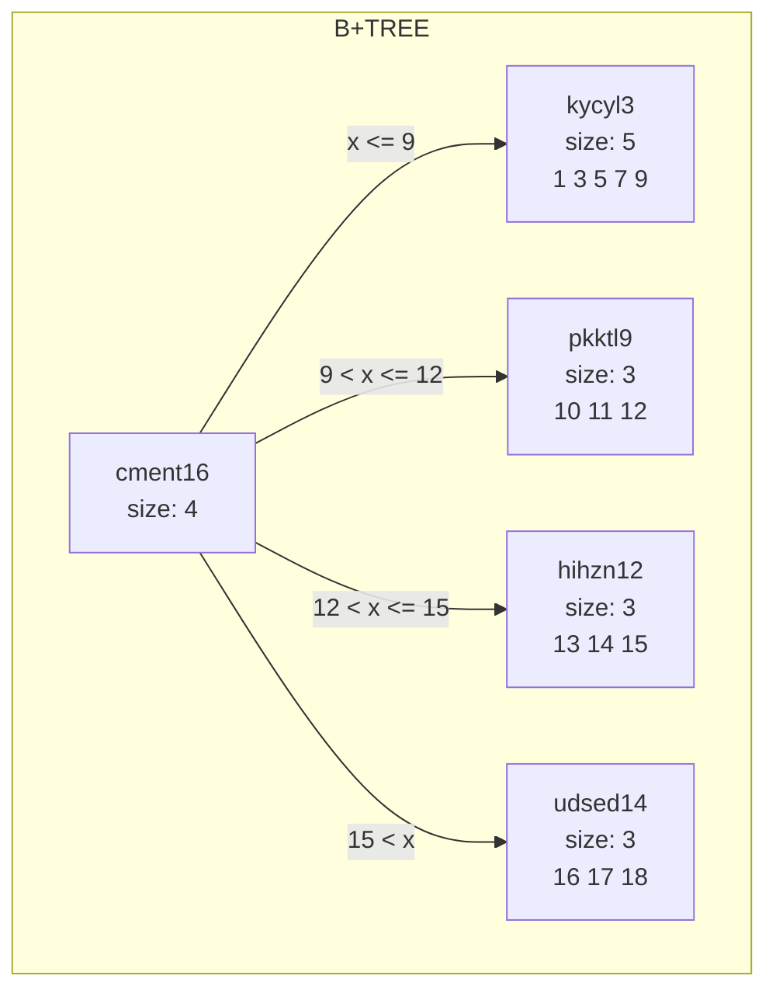
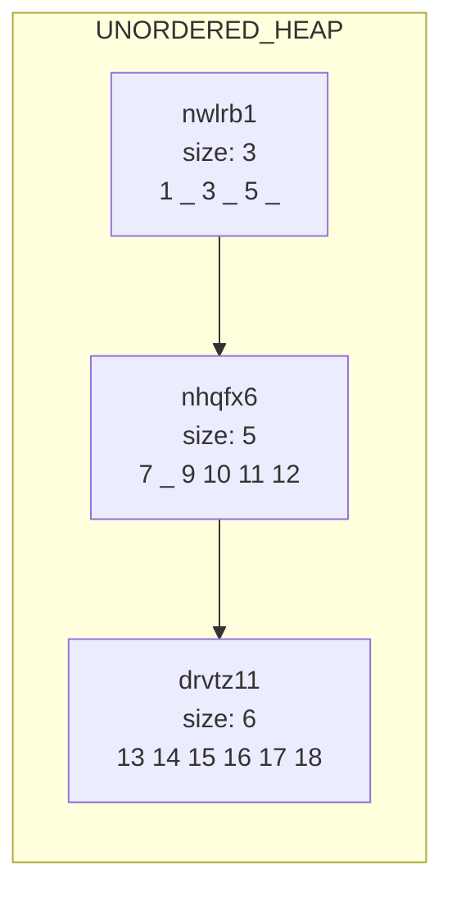

```mermaid
graph TD
subgraph B+TREE
cment16[cment16<br/>size: 4<br/>]
kycyl3[kycyl3<br/>size: 5<br/>1 3 5 7 9 ]
cment16-->|x <= 9|kycyl3
pkktl9[pkktl9<br/>size: 3<br/>10 11 12 ]
cment16-->|9 < x <= 12|pkktl9
hihzn12[hihzn12<br/>size: 3<br/>13 14 15 ]
cment16-->|12 < x <= 15|hihzn12
udsed14[udsed14<br/>size: 3<br/>16 17 18 ]
cment16-->|15 < x|udsed14
end
```

```mermaid
graph LR
subgraph UNORDERED_HEAP
nwlrb1[nwlrb1<br/>size: 3<br/>1 _ 3 _ 5 _ ]
nhqfx6[nhqfx6<br/>size: 5<br/>7 _ 9 10 11 12 ]
nwlrb1-->nhqfx6
drvtz11[drvtz11<br/>size: 6<br/>13 14 15 16 17 18 ]
nhqfx6-->drvtz11
end
```
