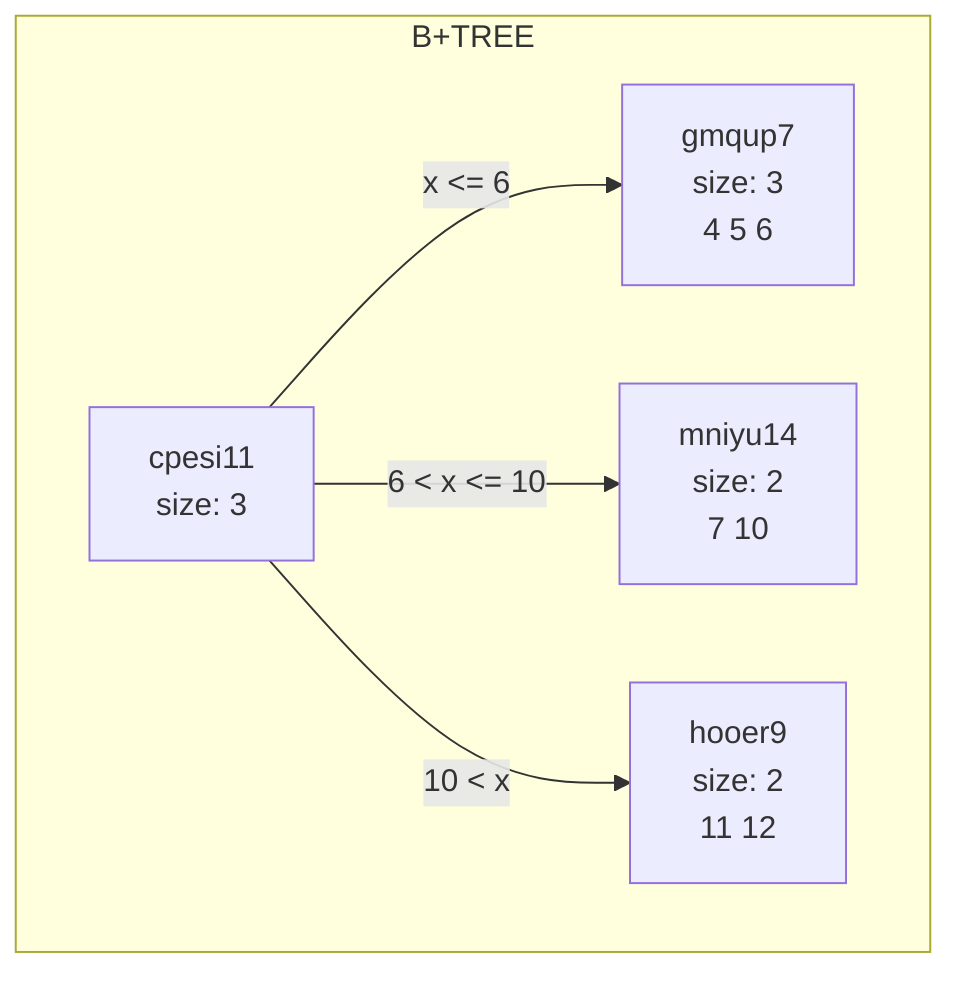
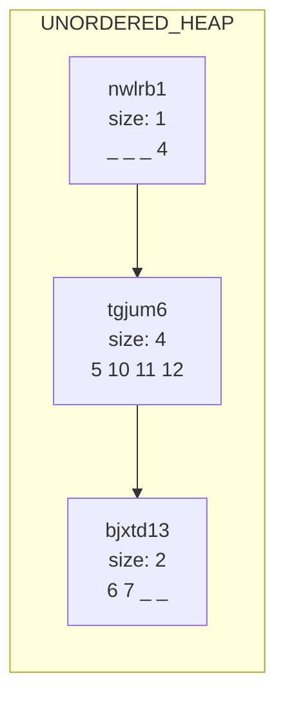

```mermaid
graph TD
subgraph B+TREE
cpesi11[cpesi11<br/>size: 3<br/>]
gmqup7[gmqup7<br/>size: 3<br/>4 5 6 ]
cpesi11-->|x <= 6|gmqup7
mniyu14[mniyu14<br/>size: 2<br/>7 10 ]
cpesi11-->|6 < x <= 10|mniyu14
hooer9[hooer9<br/>size: 2<br/>11 12 ]
cpesi11-->|10 < x|hooer9
end
```

```mermaid
graph LR
subgraph UNORDERED_HEAP
nwlrb1[nwlrb1<br/>size: 1<br/>_ _ _ 4 ]
tgjum6[tgjum6<br/>size: 4<br/>5 10 11 12 ]
nwlrb1-->tgjum6
bjxtd13[bjxtd13<br/>size: 2<br/>6 7 _ _ ]
tgjum6-->bjxtd13
end
```
