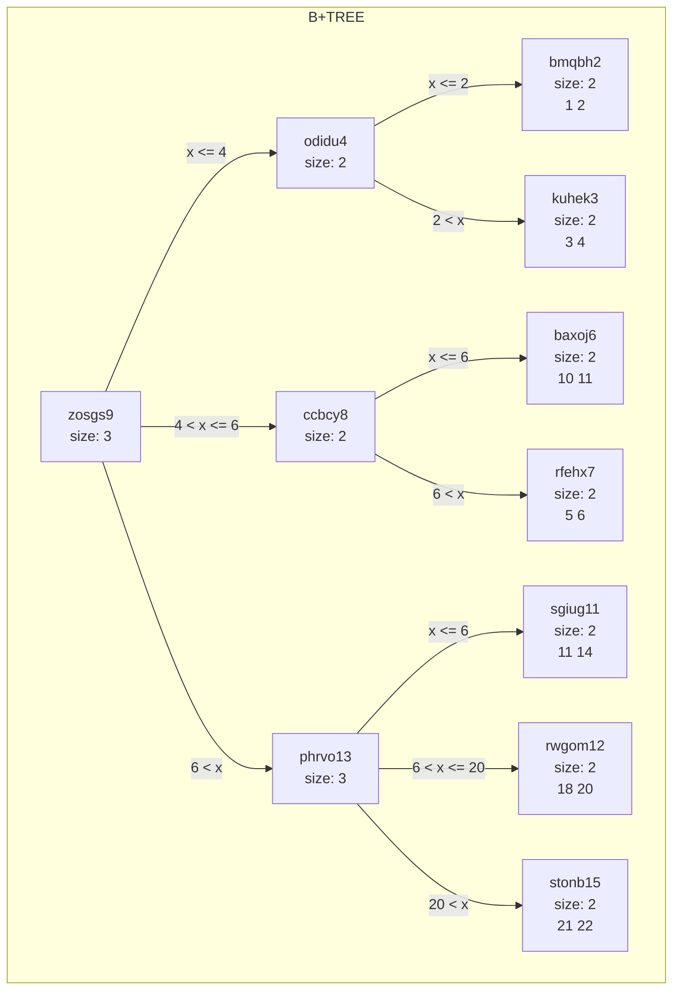
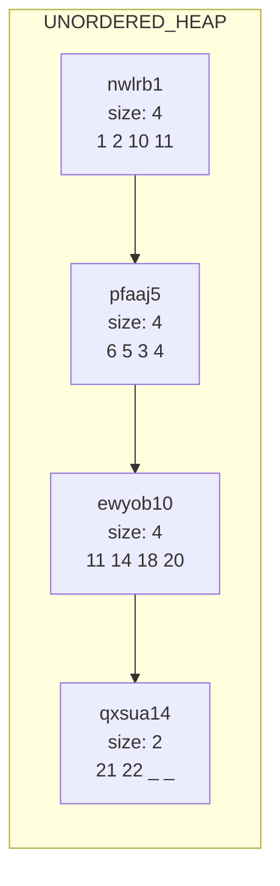

```mermaid
graph TD
subgraph B+TREE
zosgs9[zosgs9<br/>size: 3<br/>]
odidu4[odidu4<br/>size: 2<br/>]
bmqbh2[bmqbh2<br/>size: 2<br/>1 2 ]
odidu4-->|x <= 2|bmqbh2
kuhek3[kuhek3<br/>size: 2<br/>3 4 ]
odidu4-->|2 < x|kuhek3
zosgs9-->|x <= 4|odidu4
ccbcy8[ccbcy8<br/>size: 2<br/>]
baxoj6[baxoj6<br/>size: 2<br/>10 11 ]
ccbcy8-->|x <= 6|baxoj6
rfehx7[rfehx7<br/>size: 2<br/>5 6 ]
ccbcy8-->|6 < x|rfehx7
zosgs9-->|4 < x <= 6|ccbcy8
phrvo13[phrvo13<br/>size: 3<br/>]
sgiug11[sgiug11<br/>size: 2<br/>11 14 ]
phrvo13-->|x <= 6|sgiug11
rwgom12[rwgom12<br/>size: 2<br/>18 20 ]
phrvo13-->|6 < x <= 20|rwgom12
stonb15[stonb15<br/>size: 2<br/>21 22 ]
phrvo13-->|20 < x|stonb15
zosgs9-->|6 < x|phrvo13
end
```

```mermaid
graph LR
subgraph UNORDERED_HEAP
nwlrb1[nwlrb1<br/>size: 4<br/>1 2 10 11 ]
pfaaj5[pfaaj5<br/>size: 4<br/>6 5 3 4 ]
nwlrb1-->pfaaj5
ewyob10[ewyob10<br/>size: 4<br/>11 14 18 20 ]
pfaaj5-->ewyob10
qxsua14[qxsua14<br/>size: 2<br/>21 22 _ _ ]
ewyob10-->qxsua14
end
```
