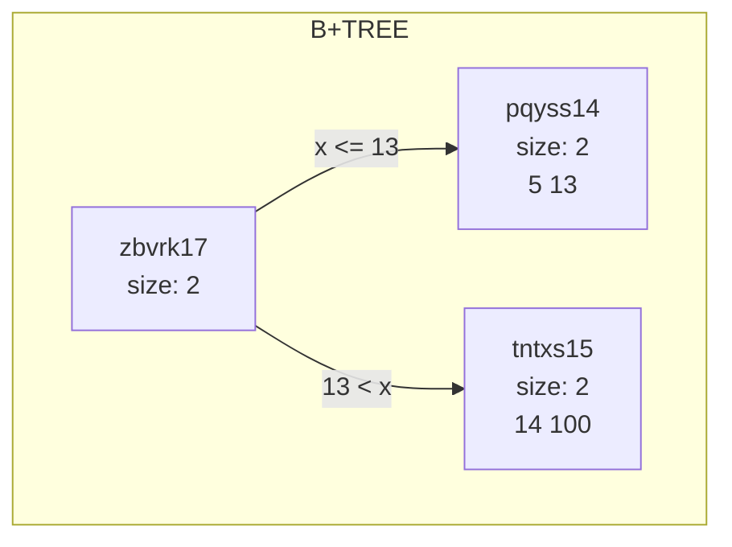
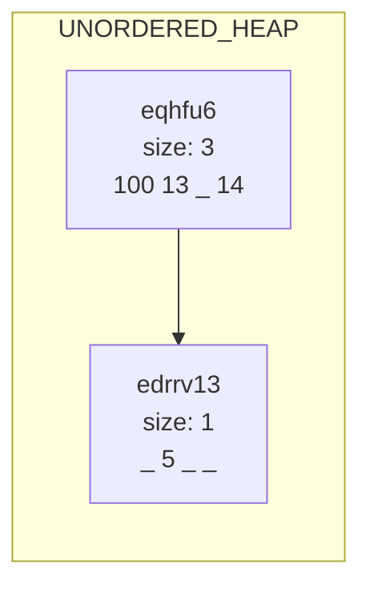

```mermaid
graph TD
subgraph B+TREE
zbvrk17[zbvrk17<br/>size: 2<br/>]
pqyss14[pqyss14<br/>size: 2<br/>5 13 ]
zbvrk17-->|x <= 13|pqyss14
tntxs15[tntxs15<br/>size: 2<br/>14 100 ]
zbvrk17-->|13 < x|tntxs15
end
```

```mermaid
graph LR
subgraph UNORDERED_HEAP
eqhfu6[eqhfu6<br/>size: 3<br/>100 13 _ 14 ]
edrrv13[edrrv13<br/>size: 1<br/>_ 5 _ _ ]
eqhfu6-->edrrv13
end
```
